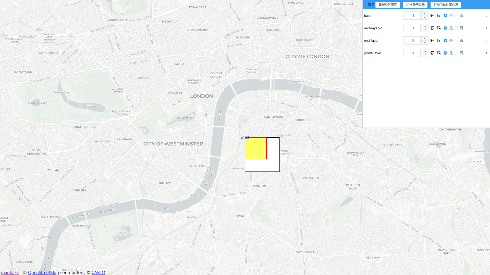
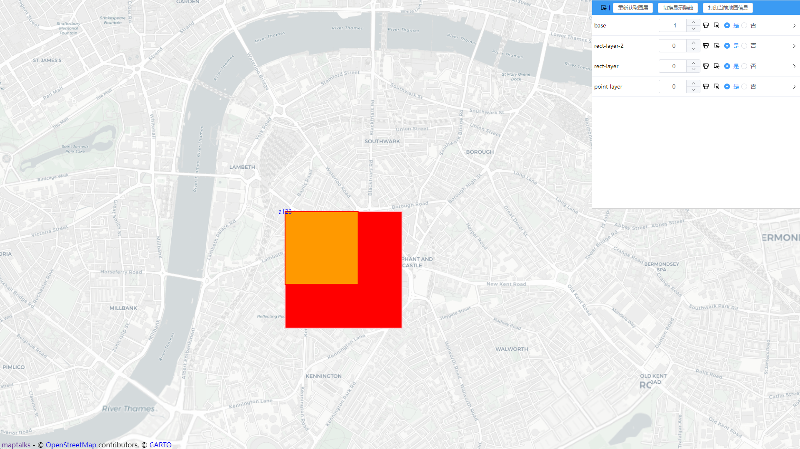
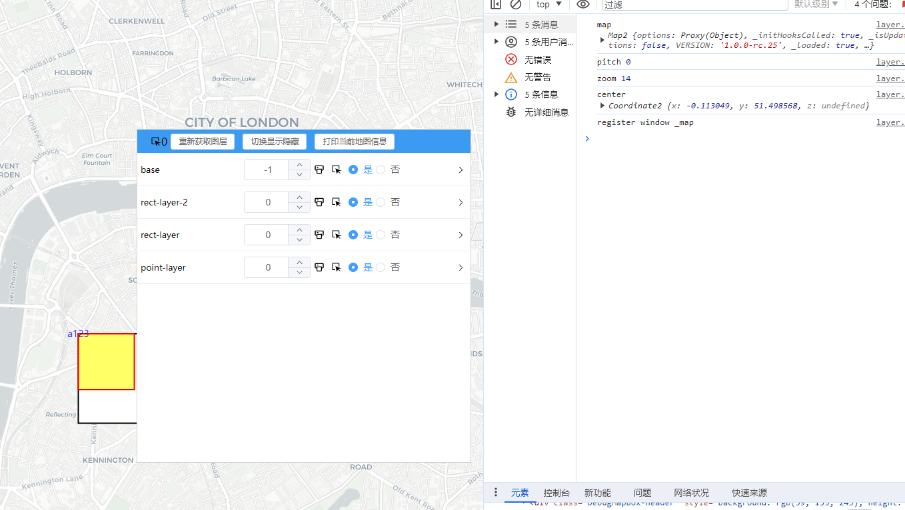
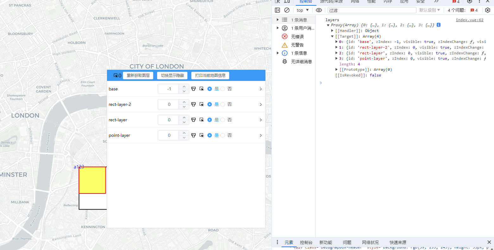

# 只要作用
解决接收一个老项目,但是你对里面的图层完全位置,节约你的时间
> 将时间留给有意义的事
# 使用
```javascript
// 传入实例化的map对象
<script src="dist/maptalksDebug.js"></script>
maptalksDebug.setMap(map)

```

# 需求开发
- [x] 图层全局隐藏显示
- [x] 当个图层切换隐藏显示
- [x] 命中单个图层中的集合体,并修改其属性



